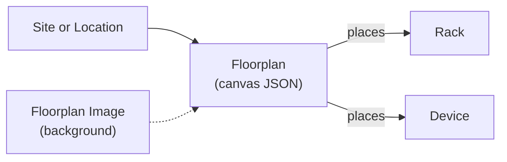

# NetBox Floorplan

[NetBox](https://github.com/netbox-community/netbox) models what equipment exists and how it is connected, but not where it physically sits within a room. A rack belongs to a site and a location, and perhaps has a facility ID — but nothing records that it is the third rack from the door, or that a row of cabinets faces a wall.

This plugin adds that missing spatial layer. A **floorplan** is a canvas attached to a site or a location, on which you place the racks and unracked devices that live there. Each placed object links back to the NetBox record it represents, so the drawing stays a view of the source of truth rather than a copy of it.

## Features

* Racks and unracked devices are placed on a canvas by dragging them from a picker, and can be moved, rotated, and scaled.

* Placed objects link through to the rack or device they represent, and their labels are kept in step with NetBox — renaming a rack updates the drawing.

* Free-form annotation: text labels, areas, and walls, with configurable colour.

* Racks can be drawn in a *simple* form (name and status) or an *advanced* form (additionally role colouring, role name, and tenant).

* A background image per floorplan, either uploaded or referenced by URL, for tracing an architectural drawing.

* Physical dimensions in metres or feet, so the canvas can be scaled to the real room.

* Keyboard controls for nudging and aligning objects.

* Export to SVG.

## Terminology

* A **floorplan** is the canvas for one site or one location. Exactly one of the two is assigned; a site and a location cannot share a floorplan record.

* A **placed object** is a rack or device drawn on the canvas. It is a group holding a rectangle and one or more text labels, tagged with metadata identifying the NetBox object.

* The **canvas** is the serialised state of the drawing, stored as a JSON document on the floorplan. It is produced and consumed by [Fabric.js](http://fabricjs.com/) in the browser.

* A **floorplan image** is a background image, held as its own object so that one image can be reused across floorplans.

* **Simple** and **advanced** describe how much NetBox metadata a placed rack or device displays.

## How a Floorplan Fits Together

A floorplan does not own the racks and devices it shows. It records their position and appearance, referencing them by ID, and re-reads their current names and statuses from NetBox each time it is viewed. If a rack is deleted, it is dropped from the drawing on the next view.

!!! note
    A floorplan is reached from the **Floor Plan** tab on a site or location, not from a top-level menu. The plugin's menu contains only Floorplan Images.

## Rack Dimensions

Racks are drawn to scale using the outer width and depth of their assigned rack type. A rack with no rack type, or a rack type with no outer dimensions, is drawn at a default size instead.

!!! important
    For racks to display at their true proportions, assign a rack type and set the outer width and depth on that type.

!!! warning
    `Rack.outer_width`, `outer_depth` and `outer_unit` are deprecated in NetBox 4.7 and will be inferred from the rack type in v5.0. This plugin already reads them from the rack type where one is assigned, so no action is needed — but setting the dimensions on the rack alone, rather than on its type, will stop working in a future NetBox release.

## Getting Started

Continue to the [installation guide](installation.md), then [Drawing a Floorplan](usage.md).
